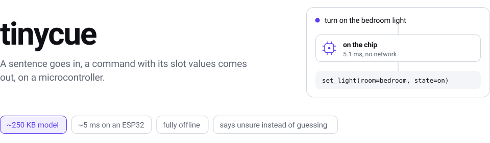
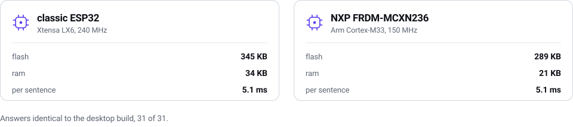
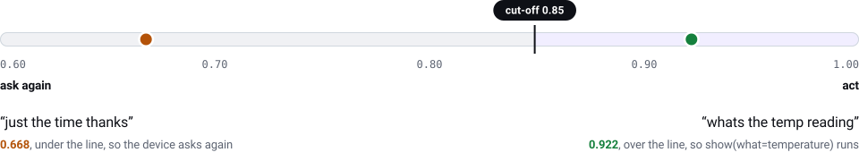

<p align="center">
  <picture>
    <source media="(prefers-color-scheme: dark)" srcset="docs/assets/hero-dark.svg">
    <source media="(prefers-color-scheme: light)" srcset="docs/assets/hero-light.svg">
    
  </picture>
</p>

tinycue turns a short list of example commands into a model small enough to live in flash and a
C99 runtime small enough to live in your firmware. It does not listen: it reads text, typed or
from a recogniser ([the voice demo](demo/voice) wires one up). Early preview.

<p align="center">
  
</p>

A real run in a throwaway directory, recorded from [`docs/assets/demo.sh`](docs/assets/demo.sh)
and rebuilt by `make demo-svg`. The third sentence is named as off topic rather than forced
into the nearest command; the fourth leans on words no example uses, so the model says so.

## Quickstart

```sh
pip install "git+https://github.com/avionicharshit-byte/tinycue"   # not on PyPI yet
tinycue init coffee
tinycue train coffee.yaml --extra coffee.extra.yaml --dev coffee.dev.yaml -o out/model
tinycue parse out/model "make me two lattes"
tinycue export out/model -o out/device --with-runtime
```

Now delete the coffee machine and write your own: the format is in
[docs/commands-file.md](docs/commands-file.md), two worked examples ship
([smart home](examples/smart_home.yaml), [robot](examples/robot.yaml)), and `tinycue doctor` names what to write next.

## Use it on a device

Export leaves four files in `out/device`: `tinycue.c`, `tinycue.h`, and your model as
`model_data.c` and `model_data.h`. Add both `.c` files to the firmware build, and link libm.

```c
#include "tinycue.h"
#include "model_data.h"              /* both come out of tinycue export */

void run(const tcue_result *r);      /* your action */
void ask(const char *sentence);      /* your "did you mean ...?" */

static tcue_model model;
static tcue_result answer;
static uint8_t scratch[12288] __attribute__((aligned(8)));

void cue_begin(void) { tcue_init(&model, tcue_model_data, tcue_model_data_len); }
void cue_line(const char *sentence)
{
    if (tcue_parse(&model, sentence, &answer, scratch, sizeof scratch) != TCUE_OK) return;
    if (answer.unsure || answer.is_none) ask(sentence); else run(&answer);
}
```

On Arduino, install [arduino/TinyCue](arduino/TinyCue) and open **File > Examples > TinyCue >
SerialCommands**. Everywhere else, hand the four files to your own build. The budget is a 32 bit
part with about 300 KB of free flash and 12 KB of RAM; the rest is [docs/install.md](docs/install.md).

## Tested on

<p align="center">
  <picture>
    <source media="(prefers-color-scheme: dark)" srcset="docs/assets/boards-dark.svg">
    <source media="(prefers-color-scheme: light)" srcset="docs/assets/boards-light.svg">
    
  </picture>
</p>

Same `runtime/tinycue.c`, same 249 KB smart home blob, and no file in `runtime/` touched to reach
the second chip. Both figures are whole flashable images: the ESP32 one is the serial example with
no screen on it, the NXP one carries that board's drivers. The round display demo is larger again,
because LVGL is in it. Per-sentence tables:
[ESP32](demo/esp32_round/board-results.md), [FRDM-MCXN236](demo/nxp_mcxn236/board-results.md).

## How it works

<p align="center">
  <picture>
    <source media="(prefers-color-scheme: dark)" srcset="docs/assets/flow-dark.svg">
    <source media="(prefers-color-scheme: light)" srcset="docs/assets/flow-light.svg">
    
  </picture>
</p>

A generator grows your handful of examples into thousands by swapping in every synonym it has
been shown. A linear classifier over word and character n-gram features picks the command; a
linear-chain CRF tags each word so slot values can be lifted out. Export flattens all of it
into one blob the runtime reads in place, so the weights stay in flash and nothing allocates.

## Unsure instead of wrong

<p align="center">
  <picture>
    <source media="(prefers-color-scheme: dark)" srcset="docs/assets/unsure-dark.svg">
    <source media="(prefers-color-scheme: light)" srcset="docs/assets/unsure-light.svg">
    
  </picture>
</p>

The confidence is calibrated and the cut-off is fitted on held-out data, not guessed. Both
sentences above are real ESP32 answers. A device that acts on a shaky answer is worse than one
that asks, so `unsure` is a first-class result rather than an error.

## Accuracy and limits

Every number below comes from sentences the model was never trained on. One set was written
to be awkward on purpose, with typos, missing words and odd synonyms; the other was written
blind by somebody who had never seen a single training sentence.

| | smart home | robot |
| --- | --- | --- |
| right answer, everyday phrasing | 96.4% | 93.5% |
| right answer, deliberately awkward phrasing | 84.0% | 70.4% |
| right when it says it is sure | 98.1% | 98.2% |

Three limits:
- It only knows the words you have shown it. Run `tinycue doctor` and add more example
  sentences until it stops complaining.
- It is not speech to text. Something else has to turn sound into words first.
- Typed Hinglish works. Spoken Hinglish only works if your speech to text engine can
  produce those words at all, and most English ones cannot.

The four test sets, the confidence gate and every variant scored: [docs/accuracy.md](docs/accuracy.md).

## How it compares

| | open source | fits an MCU | free slot values | calibrated "unsure" | Hinglish |
| --- | --- | --- | --- | --- | --- |
| Snips NLU, abandoned around 2020 | yes | no | yes | no | no |
| Rhasspy / hassil | yes | needs a Pi | template matching | no | no |
| Picovoice Rhino | no, paid | yes | yes | no | no |
| Espressif ESP-SR MultiNet | yes | yes | no, fixed phrases | no | no |
| cactus-compute/needle, 45M parameters | yes | seconds per command | yes | no | partly |
| tinycue | yes | yes | yes | yes | yes |

## Docs

- [Install and first run](docs/install.md), including the five minute path and the Arduino library
- [The commands file](docs/commands-file.md), every field of the YAML
- [How it is measured](docs/accuracy.md), the test sets and the confidence gate
- [The demos](docs/demos.md), two boards and a microphone
- [The model blob](docs/model-format.md), byte by byte, and [development](docs/development.md), the test suite and the make targets
- [The agent skill](skills/tinycue/SKILL.md), which teaches Claude Code to drive the whole loop

## Acknowledgements

Trains with CRFsuite and scikit-learn. Inspired by Snips NLU and TypeSafe's Jev.

## Licence

Apache-2.0. See [LICENSE](LICENSE).
