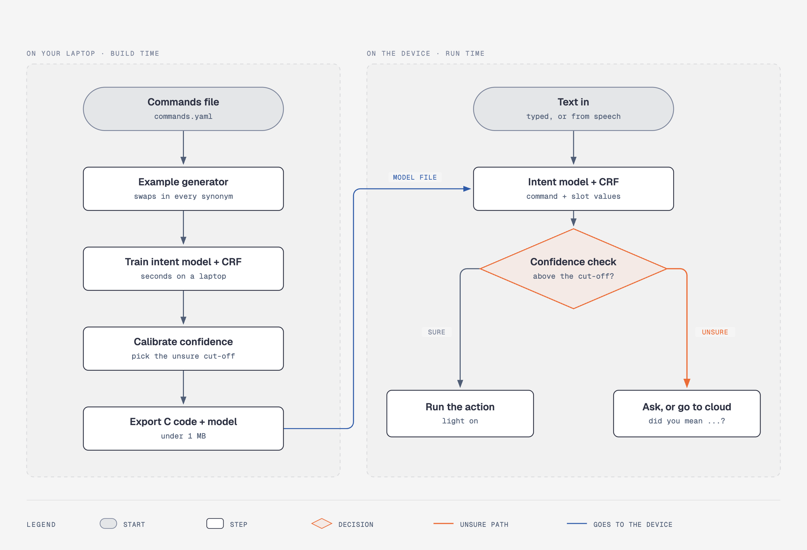

# edge-nlu

Turn a short list of example commands into a 205 KB model and two C files, so a
microcontroller can understand typed or transcribed English and Hinglish commands with no
network, no LLM and no per-request cost.

What you get from one YAML file:

- A model trained on your laptop in about 4 seconds, exported as one flat blob plus C99
  source. No malloc, no file IO, and the weights are read where they lie, so they stay in
  flash.
- An answer in 2.5 to 7.9 milliseconds on the boards below, about 7.5 microseconds on a
  desktop.
- A calibrated confidence on every answer, and a tuned cut-off below which the device says
  "unsure" instead of guessing. You choose what happens then: ask again, or hand the
  sentence to something bigger.
- English and Hinglish, Hindi typed in Latin letters, including number words. "10", "ten"
  and "das" all arrive as `10`.

edge-nlu is not speech to text. Any recogniser can feed it text; see
[the voice demo](demo/voice) for one that does.

**Status: early, private preview.** It works and it is measured, but the APIs and the
model format may still change. Apache-2.0.



## Thirty seconds with it

You write the commands and the words people use for them. Slot spans are marked
`[surface text](slot_name)`.

```yaml
language: [en, hinglish]

slots:
  room:
    values:
      bedroom: [bedroom, bed room, sone ka kamra, kamre]
      kitchen: [kitchen, rasoi]
  state:
    values:
      "on": ["on", chalu, jala do, jalao]
      "off": ["off", band, bujha do, band kar do]

commands:
  - name: set_light
    slots: [room, state]
    examples:
      - "turn [on](state) the [bedroom](room) light"
      - "[rasoi](room) mein light [jala do](state)"
```

Then three commands:

```sh
.venv/bin/edgenlu check examples/smart_home.yaml
.venv/bin/edgenlu train examples/smart_home.yaml -n 1500 --seed 0 -o out/model
.venv/bin/edgenlu export out/model -o out/device
```

And you can read sentences:

```
$ .venv/bin/edgenlu parse out/model "turn on the bedroom light"
set_light(state=on, room=bedroom) confidence=1.00

$ .venv/bin/edgenlu parse out/model "rasoi mein light jala do"
set_light(room=kitchen, state=on) confidence=1.00

$ .venv/bin/edgenlu parse out/model "das minute ka timer laga do"
set_timer(minutes=10) confidence=1.00

$ .venv/bin/edgenlu parse out/model "i am a big fan of cricket"
none confidence=0.97

$ .venv/bin/edgenlu parse out/model "light band karo"
set_light(state=off) confidence=0.99 missing: room

$ .venv/bin/edgenlu parse out/model "flick the bedroom lamp on"
unsure (best guess: none confidence=0.65)
```

Four things happened there. A Hindi number word came back as an integer. An off-topic
sentence was named as off-topic rather than forced into the nearest command. A sentence
that named no room said which slot was missing instead of inventing one. And "flick" and
"lamp", which appear in no example sentence, dropped the confidence under the cut-off, so
the device asks rather than guesses. The Python command line rounds confidence to two
decimals; the C runtime prints the full number, and the first sentence there reads
`"confidence":0.995596,"intent":0.999083,"slot":0.986114,"unsure":false`.

## How it works

Two words are worth defining first. The **intent** is which command was meant:
`set_light`, `set_timer`, or `none` for anything off-topic. The **slots** are the values
that command carries: which room, which state, how many minutes. "turn on the bedroom
light" has the intent `set_light` and the slots `room=bedroom, state=on`.

On your laptop:

1. A generator grows your handful of examples into thousands, swapping in every slot value
   and synonym, inserting filler words, dropping carrier words and swapping equivalent
   words. It never touches a token inside a slot span.
2. Two small models train on that. A linear classifier over word and character n-gram
   features picks the intent. A linear-chain CRF labels each word so the slot values can
   be pulled out. Tags carry the slot *type*, not the slot name, so two commands that both
   take a `direction` share every training example of it.
3. Calibration makes the confidence honest and picks the cut-off: temperature scaling on
   the intent probability, a fitted exponent on the tagger's sequence probability, and the
   lowest cut-off whose accepted answers are right at least 99% of the time on dev data.
4. Export writes the whole thing as one blob, plus the same bytes as a `const unsigned
   char[]` for flashing. The format is in [docs/model-format.md](docs/model-format.md).

On the device, text goes in and a command, its slot values, any required slot left out,
and a confidence come back. Under the cut-off the `unsure` flag is set, and the best guess
is still filled in so you can show it. A value the tagger finds but nobody listed is
passed through as text with `known` set to 0, which is how an invented name survives.

## Boards tested

The same `runtime/edgenlu.c` and the same smart home model on both, over the same 31
sentences. Nothing in `runtime/` was changed to port it to the second chip, and the build
is warning free.

| | classic ESP32 | NXP FRDM-MCXN236 |
| --- | --- | --- |
| core | Xtensa LX6, 240 MHz | Arm Cortex-M33, 150 MHz |
| build | Arduino sketch, round display | bare metal, no RTOS |
| flash image | 540,632 bytes, 41% of the app partition | 241,352 bytes, 23% of 1 MB |
| static RAM | 40,828 bytes | 20,976 bytes |
| model blob, in flash | 209,640 bytes | 209,640 bytes |
| scratch buffer | 10,712 bytes | 10,712 bytes |
| parse: fastest, mean, slowest | 2,537 / 4,376 / 6,534 us | 2,318 / 4,805 / 7,873 us |
| sentences matching the desktop | 31 of 31 | 31 of 31 |
| free heap after 31 sentences | unchanged from boot | no heap at all |

The two flash numbers are not the same measurement: the ESP32 image carries the Arduino
core and the display library, the MCXN236 one carries four NXP drivers. Both are timed
around `enlu_parse` alone, on the board, with `-DENLU_FAST_EXP`, which does the two
exponentials in the CRF forward pass in single precision. On the M33, which has no
hardware double, that flag is worth 2.7 times for identical answers. Per-sentence tables:
[ESP32](demo/esp32_round/board-results.md),
[FRDM-MCXN236](demo/nxp_mcxn236/board-results.md).

## Use it in your firmware

Copy `runtime/edgenlu.h` and `runtime/edgenlu.c` into your project along with the
`model_data.c` and `model_data.h` that `edgenlu export` wrote. There is nothing else to
link.

```c
#include <stdio.h>
#include "edgenlu.h"      /* the runtime, two files, nothing else */
#include "model_data.h"   /* enlu_model_data[] and its length, written by edgenlu export */
void ask_again(void);     /* your own "did you mean ...?" prompt */

static enlu_model model;
static enlu_result out;
static uint8_t scratch[12288] __attribute__((aligned(8)));

int nlu_begin(void)                     /* once, at boot */
{
    if (enlu_init(&model, enlu_model_data, enlu_model_data_len) != ENLU_OK) return -1;
    return enlu_scratch_size(&model) <= sizeof scratch ? 0 : -1;
}

void nlu_handle(const char *sentence)   /* once per sentence */
{
    int i;
    if (enlu_parse(&model, sentence, &out, scratch, sizeof scratch) != ENLU_OK) return;
    if (out.unsure || out.is_none) { ask_again(); return; }
    printf("%s at %.2f\n", out.command, out.confidence);
    for (i = 0; i < out.slot_count; i++)
        if (out.slots[i].is_number) printf("  %s = %d\n", out.slots[i].name, (int)out.slots[i].number);
        else                        printf("  %s = %s\n", out.slots[i].name, out.slots[i].text);
    for (i = 0; i < out.missing_count; i++) printf("  %s missing\n", out.missing[i]);
}
```

`enlu_scratch_size` asked for 10,712 bytes for the smart home model, so the buffer above
has room to spare. Both calls return a negative code on refusal, which `enlu_error` turns
into a line of text. Nothing after `enlu_init` allocates or opens a file. The same runtime
builds for the desktop, for trying things without a board:

```sh
make cli
echo "fan tez karo" | runtime/enlu_cli out/device/model.bin
```

```
{"text":"fan tez karo","command":"set_fan","slots":{"speed":"up"},"missing":[],
 "confidence":0.998809,"intent":0.999447,"slot":0.997450,"unsure":false,"micros":15.0}
```

## The commands file

One YAML file is the whole input. Beyond `slots` and `commands` it takes three optional
blocks: `equivalents` (word groups the generator swaps around), `fillers` (extra filler
words) and `none_examples` (off-topic sentences, which is where near misses like "i am a
big fan of cricket" belong). A `fallback` block sets the unsure cut-off, or leaves it on
`auto`. Filler words, droppable carrier words and a base list of off-topic sentences come
from the language files in `src/edgenlu/langs/`, picked by the `language:` list.

Two worked examples ship, from unrelated domains and commented line by line:
[examples/smart_home.yaml](examples/smart_home.yaml) (lights, fan, timer, sensor readings)
and [examples/robot.yaml](examples/robot.yaml) (drive, turn, stop, gripper, speed).
Nothing in the Python package knows about either one, and a test fails the build if a
domain word ever appears in `src/edgenlu`.

## Demos

**[ESP32 with a round display](demo/esp32_round).** The smart home model on a classic
ESP32 driving a 1.28 inch GC9A01 panel. It reads a sentence from USB serial, answers with
one JSON line, and draws the command on the screen with a confidence ring around the rim.
No Wi-Fi.

```sh
make model && make demo-flash && .venv/bin/python demo/send.py "turn on the bedroom light"
```

**[Cortex-M33, bare metal](demo/nxp_mcxn236).** The portability proof: the same runtime on
an NXP FRDM-MCXN236, no RTOS, no heap, flashed over the on-board debug probe. It answers
on the debug serial port and lights the red LED when the answer is unsure.

```sh
make model && make nxp-flash && .venv/bin/python demo/send.py -p /dev/cu.usbmodem<probe>3 "turn on the bedroom light"
```

**[Saying it out loud](demo/voice).** The FRDM-MCXN236 streams its on-board microphone to
a Mac at 16 kHz over its debug serial port at 1 Mbaud, the Mac turns speech into text with
[Vosk](https://alphacephei.com/vosk/) offline, and the sentence goes back to both boards.

```sh
make voice-model && make voice-flash && .venv/bin/python demo/voice/listen.py
```

Five commands played out loud into the room were all understood, 795 to 1,099 milliseconds
from the last sound to the answer, of which 44 milliseconds was the two boards and the
rest was Vosk deciding the sentence had ended. The audio link lost no packets in 30
seconds. Hinglish cannot be spoken to this demo at all: Vosk's English models have no
entry for 152 of the 481 words in the smart home file, and a word outside a
grammar-constrained recogniser's list can never come out of it. Typed Hinglish works.

## Accuracy and limits

Two test sets, because they answer different questions. The **generated split** holds out
whole phrasings, so it measures variations of wording you did write. The **hand-written
held-out files** in `eval/` share no wording with the commands file at all and carry
typos, missing slots and deliberate synonyms. That second one is the honest test.

<!-- ACCURACY-UPDATE -->

| smart home model | generated split | hand-written held-out |
| --- | --- | --- |
| sentences | 1018 | 144 |
| full command accuracy | 92.7% | 75.7% |
| sent to unsure | 31.9% | 48.6% |
| wrong answers caught by the cut-off | 100.0% | 85.7% |
| accepted answers right | 100.0% | 93.2% |

On wording it has never seen the model is not accurate, and the useful part is that it
knows: it throws away almost half its answers, catches 86% of the ones that would have
been wrong, and what reaches your code is right 93% of the time. The robot example is the
harder case, at 39.8%. Its `stop`, `grab` and `release` commands carry no slots, so
nothing but the literal words identifies them, and its held-out file deliberately uses
synonyms ("seize", "unclamp") that appear nowhere in the commands file.

**Closing that gap is the active work.** An agent skill that writes varied training
sentences from a commands file, and an `edgenlu doctor` command that names the commands
with thin coverage, are both in progress.

Four other limits worth knowing: input is capped at 32 tokens and 256 bytes, and longer
input is refused rather than truncated; Hinglish is typed only until there is a recogniser
with a code-mixed lexicon; the round display and the NXP LED have never been checked by
eye, so the JSON is verified and the pixels are not; and the blob is dominated by the
hashed feature table, so a model with fewer commands is not much smaller, with
`--table-size` the only knob.

Full tables, both example specs, and the C versus Python parity numbers are in
[docs/accuracy.md](docs/accuracy.md).

## How it compares

| | open source | fits an MCU | free slot values | calibrated "unsure" | Hinglish |
| --- | --- | --- | --- | --- | --- |
| Snips NLU, abandoned around 2020 | yes | no | yes | no | no |
| Rhasspy / hassil | yes | needs a Pi | template matching | no | no |
| Picovoice Rhino | no, paid | yes | yes | no | no |
| Espressif ESP-SR MultiNet | yes | yes | no, fixed phrases | no | no |
| cactus-compute/needle, 45M parameters | yes | seconds per command | yes | no | partly |
| edge-nlu | yes | yes, 205 KB | yes | yes | yes |

The gap this fills: nothing else is open source *and* microcontroller sized *and* able to
generalise past exact templates *and* honest enough about its own confidence to refuse.

## Roadmap

1. **Accuracy on unseen phrasing.** A training-sentence generator and `edgenlu doctor`, so
   a commands file with thin coverage says so before you flash it.
2. **Packaging.** A pip install, and an Arduino library so the runtime and a model drop
   straight into a sketch.
3. **Public release.** A name that is not a working name, and a first tagged version.

[PLAN.md](PLAN.md) has the milestone history and the open questions.

## Development

Python 3.10 or newer. Using [uv](https://docs.astral.sh/uv/):

```sh
uv venv --python 3.12
uv pip install -e ".[dev]"
.venv/bin/pytest -q          # 237 tests, about 8 seconds
make cli                     # build the desktop C command line tool
```

The test suite includes a full train on a small dataset and the C parity run, which builds
the runtime with `cc` and skips cleanly when no C compiler is installed.

## Credits

The recipe, a linear intent classifier plus a CRF slot tagger, is the one
[Snips NLU](https://github.com/snipsco/snips-nlu) used before it was abandoned. The
framing of the output as a typed decision with a calibrated confidence, never free text,
is borrowed from TypeSafe's Jev model. What is new here is making that fit a
microcontroller: the flat blob read out of flash, the C99 runtime with no allocation, the
tuned unsure path, and Hinglish.

## Licence

Apache-2.0. See [LICENSE](LICENSE).
